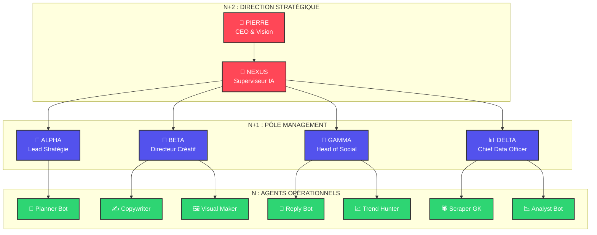

# 📊 Timalaus Corp - Organigramme Visuel

> **K-HIVE SYSTEM** : Représentation dynamique de notre Entreprise Virtuelle.

## 🗺️ Légende
*   🔴 **Rouge** : Décideurs (Vous & Nexus)
*   🔵 **Bleu** : Managers (Coordinateurs)
*   🟢 **Vert** : Exécutants (Agents spécialisés)
